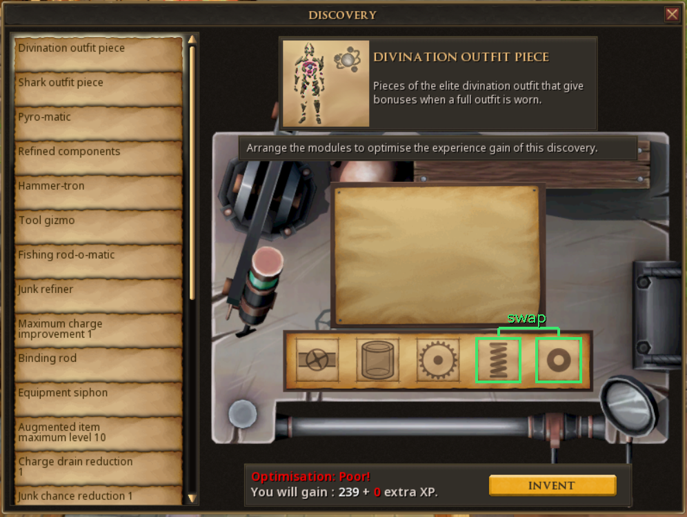
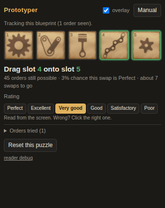

# Prototyper

An [Alt1](https://runeapps.org/alt1) app for RuneScape 3 that solves the Invention **discovery** puzzle — "Arrange the modules to optimise the experience gain of this discovery" — in as few swaps as possible.

It watches the module row and the *Optimisation* rating on your screen, works out which hidden orders are still possible, and draws the next swap on top of the game: two green boxes joined by a bracket. Drag one boxed module onto the other, wait a second for the new rating, follow the next pair. When the rating says **Perfect**, press Invent.





## Install

Paste this into Alt1's browser address bar (or any browser with Alt1 installed):

```
alt1://addapp/https://projects.scottcardone.com/prototyper/appconfig.json
```

Give it the **pixel** (screen reading) and **overlay** permissions when Alt1 asks. For local development run `serve.cmd` and use `alt1://addapp/http://localhost:8231/appconfig.json` instead.

Requirements: the whole Discovery window visible, nothing else. It works at any **Windows display scaling** (Alt1 sees the game at its native size either way, and draws the overlay in the same coordinates it captures in) and at any **in-game interface scaling** (the window is found by its shape and everything is measured from the size it is found at). No build step — it's plain HTML/JS.

## Using it

1. Open a discovery at an Inventor's workbench and drag the five modules from the sheet onto the track, in any order (until then the app just says it has found the window and is waiting). The rating appears once all five are placed.
2. After about a second the app shows the five modules with two highlighted, and the same two are boxed in the game. Drag one onto the other.
3. Repeat until it says *Perfect — press Invent*.

You don't have to obey it. Any swap you make is read off the screen and used as information, so you can ignore a suggestion, and progress is remembered per blueprint — close the window or Alt1 halfway and it picks up where you left off.

If the **rating is read wrong**, click the right one in the row of rating buttons. The app remembers what that rating looks like (its width and colour) and reads it correctly from then on.

**Manual mode** (button top right, and the only mode outside Alt1): call the modules A–E, click the rating the game shows, click two tiles to mirror each swap you make, click the new rating.

## How many swaps does it take?

`npm run simulate` plays every possible puzzle (7,200 hidden states) from a cold start:

| method | average swaps | worst case |
|---|---|---|
| Prototyper | **7.0** | 13 |
| try each pair, keep it if the rating improves, else put it back | 26.3 | 67 |

By starting rating, Prototyper averages 5.4 swaps from Excellent, 6.2 from Very good, 6.7 from Good, 7.1 from Satisfactory and 7.4 from Poor. Deeper searches (nested roll-outs of the same policy) only shave another ~0.05, so this is close to what the puzzle allows: the rating is a coarse signal and every look at a new order costs a swap.

## How it works

**The puzzle** (per the [RuneScape wiki](https://runescape.wiki/w/Discovery)): each slot has a hidden rank 1–5 and each module has a hidden rank 1–5. An order scores the sum over slots of |slot rank − module rank|, shown only as a bucket: 0 Perfect, 2 Excellent, 4 Very good, 6 Good, 8 Satisfactory, 10–12 Poor. Slot ranks are *not* left-to-right (two screenshots of one blueprint, Very Good then Perfect, confirm that), so there are 120 × 120 hidden states, 7,200 after removing the mirror image that scores identically. The solution is fixed per player per blueprint.

**The solver** (`src/solver.js`) keeps the set of hidden states consistent with every (order, rating) seen. For each of the 120 orders it could go and look at, it estimates `swaps to get there + expected [swap distance to the solution + 0.75 × entropy of the remaining solutions]` after seeing that order's rating, and steps toward the best one through the most informative intermediate order. With 300 or fewer states left it instead scores each of the 10 swaps by playing that policy out to the end. If the game ever contradicts the model (no state fits), it says so and falls back to a never-revisit hill climb, so it still finishes.

**The reader** (`src/reader.js`) needs no icon library:

- finds the window two ways. At native size, pixel templates of the module strip's two ends (Alt1 searches those natively, in a millisecond). At any other interface scale — or if the templates ever stop matching — a whole-capture search every few idle reads: parchment-coloured rectangles with the strip's proportions are candidates. Either way the ten thin frame lines of the five slots (a very regular pattern: 0, 49, 70, 119 … 329 px) are then fitted, which gives the exact position *and* the exact scale. All other geometry is relative to that and multiplied by the scale. Once found, the window is followed from its last position;
- fingerprints the artwork in each slot (14 × 14 normalised brightness grid; a slot counts as empty when it has no fine detail, which keeps faint outline modules from being mistaken for bare parchment). The same module matches itself at ≥ 0.99 in any slot; different modules score ≤ 0.65. Modules are simply "whatever was in slots 1–5 when this blueprint was first seen";
- isolates the bright rating text from its dark panel (the line is coloured for some ratings and plain white for others) and classifies the word after `Optimisation:` without any font: its width relative to `Optimisation:` ("Poor!" 0.35, Perfect 0.52, Excellent 0.63, Very Good 0.74, Satisfactory 0.90 measured; Good ≈ 0.35 estimated), whether it is two words (only Very Good), and for the two short ones the colour ("Poor!" is red) and whether the first letter has ink in its bottom-right corner (G yes, P no). Rating colours seen so far: Perfect green, Excellent white, Very Good yellow, Satisfactory orange, Poor red; colour is stored with user corrections. These features don't depend on font size;
- hashes the blueprint title/description box so each blueprint gets its own saved session.

**The tracker** (`src/tracker.js`) only accepts a reading once the same order + rating has been seen on three consecutive reads (~1 s), so half-finished drags and a rating that updates a moment after the modules never reach the solver. If a known order later shows a different rating, the newer reading wins and the history is corrected.

## Files

```
index.html, style.css, appconfig.json, icon.png
src/solver.js     the puzzle model + swap policy (also a node module)
src/reader.js     screen reading
src/anchor.js     GENERATED pixel templates + geometry
src/tracker.js    reads -> observations, per-blueprint sessions, persistence
src/app.js        UI, polling loop, overlay
tools/make-anchor.js   cuts src/anchor.js out of the screenshots in test/
tools/simulate.js      plays every puzzle, prints the table above
tools/serve.js, serve.cmd   local static server
test/run.js       67 headless checks (npm test), incl. the capture resized to x0.9 / x1.25 / x1.5 / x2
test/ui.js        full-app browser test with a fake Alt1 (needs playwright)
vendor/a1lib.js   Alt1 library (capture, image search, overlay colours)
```

## Recalibrating

Everything pixel-specific lives in `src/anchor.js`, generated from **an Alt1 capture** (`test/capture-satisfactory.png`), not a Windows screenshot. That distinction matters: with Windows display scaling at 125%, a screenshot shows the game enlarged 1.25×, while Alt1 receives the game at its native size (on the test machine inside a larger black-padded buffer; overlays still use the capture's coordinates). Templates cut from a screenshot never match what Alt1 sees (this is exactly what broke v1.0).

- **Get a capture:** in the app, *reader debug → Download this capture*.
- **Jagex moves the interface around:** replace the capture in `test/` (taken at 100% interface scaling), update `REF.origin` (top-left pixel of the module strip's dark border) and the `GEO` numbers at the top of `tools/make-anchor.js`, run `node tools/make-anchor.js --write`, then `npm test`.
- `npm test path/to/capture.png` prints what the reader sees in any capture.
- The version is shown bottom-right in the app and at the top of *reader debug*; bump `VERSION` in `src/app.js` and the `?v=` strings in `index.html` together so Alt1's browser cache can't serve stale scripts.

## Limits

- Interface scales other than 100% have been tested on resized copies of a real capture (x0.9 to x2), not yet on the game's own scaler; if yours isn't found, send a capture from *reader debug*.
- Changing the interface scale mid-puzzle starts that blueprint's puzzle over (the saved session is tied to how the title looks).
- Only the ordering step is covered, not the "pick 5 of 10 materials" step before it.
- Every rating except Good has been seen in a real capture or screenshot; Good is recognised from its estimated width and first letter. A wrong read is corrected with one click, and if the rating can't be read at all the app asks you to click it.
- The overlay is drawn in capture coordinates, which is right on the setup it was tested on (including a black-banded capture). If the boxes land in the wrong place on yours, the footer has an *overlay scale* override.
