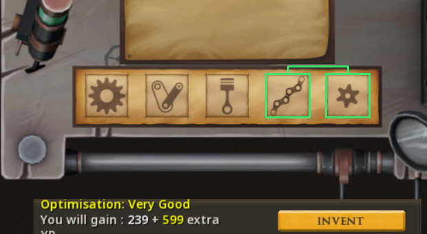

# Prototyper

An [Alt1](https://runeapps.org/alt1) app for RuneScape 3 that solves the Invention **discovery** puzzle — "Arrange the modules to optimise the experience gain of this discovery" — in as few swaps as possible.

It watches the module row and the *Optimisation* rating on your screen, works out which hidden orders are still possible, and draws the next swap on top of the game: two green boxes joined by a bracket. Drag one boxed module onto the other, wait a second for the new rating, follow the next pair. When the rating says **Perfect**, press Invent.




## Install

Paste this into Alt1's browser address bar (or any browser with Alt1 installed):

```
alt1://addapp/https://projects.scottcardone.com/prototyper/appconfig.json
```

Give it the **pixel** (screen reading) and **overlay** permissions when Alt1 asks. For local development run `serve.cmd` and use `alt1://addapp/http://localhost:8231/appconfig.json` instead.

Requirements: interface scale at **100%**, and the whole Discovery window visible. No build step — it's plain HTML/JS.

## Using it

1. Open a discovery at an Inventor's workbench and get to the module row (pick the five materials as usual — Prototyper only deals with the ordering).
2. After about a second the app shows the five modules with two highlighted, and the same two are boxed in the game. Drag one onto the other.
3. Repeat until it says *Perfect — press Invent*.

You don't have to obey it. Any swap you make is read off the screen and used as information, so you can ignore a suggestion, and progress is remembered per blueprint — close the window or Alt1 halfway and it picks up where you left off.

If the **rating is read wrong**, click the right one in the row of rating buttons. The app remembers what that word looks like and reads it correctly from then on. (Out of the box it has pixel templates for *Very Good* and *Perfect*; the other four are recognised by word shape until a screenshot of each is added — see *Recalibrating*.)

**Manual mode** (button top right, and the only mode outside Alt1): call the modules A–E, click the rating the game shows, click two tiles to mirror each swap you make, click the new rating.

## How many swaps does it take?

`npm run simulate` plays every possible puzzle (7,200 hidden states) from a cold start:

| method | average swaps | worst case |
|---|---|---|
| Prototyper | **7.0** | 13 |
| try each pair, keep it if the rating improves, else put it back | 26.3 | 67 |

By starting rating, Prototyper averages 5.4 swaps from Excellent, 6.2 from Very good, 6.7 from Good, 7.1 from Satisfactory and 7.4 from Poor. Deeper searches (nested roll-outs of the same policy) only shave another ~0.05, so this is close to what the puzzle allows: the rating is a coarse signal and every look at a new order costs a swap.

## How it works

**The puzzle** (per the [RuneScape wiki](https://runescape.wiki/w/Discovery)): each slot has a hidden rank 1–5 and each module has a hidden rank 1–5. An order scores the sum over slots of |slot rank − module rank|, shown only as a bucket: 0 Perfect, 2 Excellent, 4 Very good, 6 Good, 8 Satisfactory, 10–12 Poor. Slot ranks are *not* left-to-right (the two reference screenshots in `test/` confirm that), so there are 120 × 120 hidden states, 7,200 after removing the mirror image that scores identically. The solution is fixed per player per blueprint.

**The solver** (`src/solver.js`) keeps the set of hidden states consistent with every (order, rating) seen. For each of the 120 orders it could go and look at, it estimates `swaps to get there + expected [swap distance to the solution + 0.75 × entropy of the remaining solutions]` after seeing that order's rating, and steps toward the best one through the most informative intermediate order. With 300 or fewer states left it instead scores each of the 10 swaps by playing that policy out to the end. If the game ever contradicts the model (no state fits), it says so and falls back to a never-revisit hill climb, so it still finishes.

**The reader** (`src/reader.js`) needs no icon library:

- finds the window by pixel-matching the two ends of the module strip;
- fingerprints the artwork in each slot (18 × 18 normalised brightness grid). The same module matches itself at ≥ 0.99 in any slot; different modules score ≤ 0.47. Modules are simply "whatever was in slots 1–5 when this blueprint was first seen";
- isolates the coloured rating text by saturation (yellow, green, whatever colour the rating uses), template-matches the fixed `Optimisation:` prefix to find the line, then classifies the word after it: learned words → built-in templates → shape rules (two words = Very good, starts with G = Good, starts with P = Poor/Perfect by width, otherwise Excellent/Satisfactory by width);
- hashes the blueprint title/description box so each blueprint gets its own saved session.

**The tracker** (`src/tracker.js`) only accepts a reading once the same order + rating has been seen on three consecutive reads (~1 s), so half-finished drags and a rating that updates a moment after the modules never reach the solver. If a known order later shows a different rating, the newer reading wins and the history is corrected.

## Files

```
index.html, style.css, appconfig.json, icon.png
src/solver.js     the puzzle model + swap policy (also a node module)
src/reader.js     screen reading
src/anchor.js     GENERATED pixel templates + geometry
src/tracker.js    reads -> observations, per-blueprint sessions, persistence
src/app.js        UI, polling loop, overlay
tools/make-anchor.js   cuts src/anchor.js out of the screenshots in test/
tools/simulate.js      plays every puzzle, prints the table above
tools/serve.js, serve.cmd   local static server
test/run.js       39 headless checks (npm test)
test/ui.js        full-app browser test with a fake Alt1 (needs playwright)
vendor/a1lib.js   Alt1 library (capture, image search, overlay colours)
```

## Recalibrating

Everything pixel-specific lives in `src/anchor.js`, generated from lossless screenshots of the Discovery window at 100% scale:

- **Teach it another rating word properly:** take a screenshot (or use *reader debug → Download this capture* in the app) while the game shows Excellent / Good / Satisfactory / Poor, save it into `test/`, add it to `EXTRA` in `tools/make-anchor.js`, run `node tools/make-anchor.js --write`, then `npm test`.
- **Jagex moves the interface around:** replace `test/shot-verygood.png`, update `REF.origin` (top-left pixel of the module strip) and the `GEO` numbers at the top of `tools/make-anchor.js`, regenerate.
- `npm test path/to/capture.png` prints what the reader sees in any capture.

## Limits

- 100% interface scale only; the templates are pixel-exact.
- Only the ordering step is covered, not the "pick 5 of 10 materials" step before it.
- The rating words other than Very Good and Perfect have not been seen in a real capture yet — they're recognised by shape and can be corrected with one click.
- The overlay calls follow Alt1's documented API but have only been exercised against a fake Alt1 so far; the first real run is the real test.
